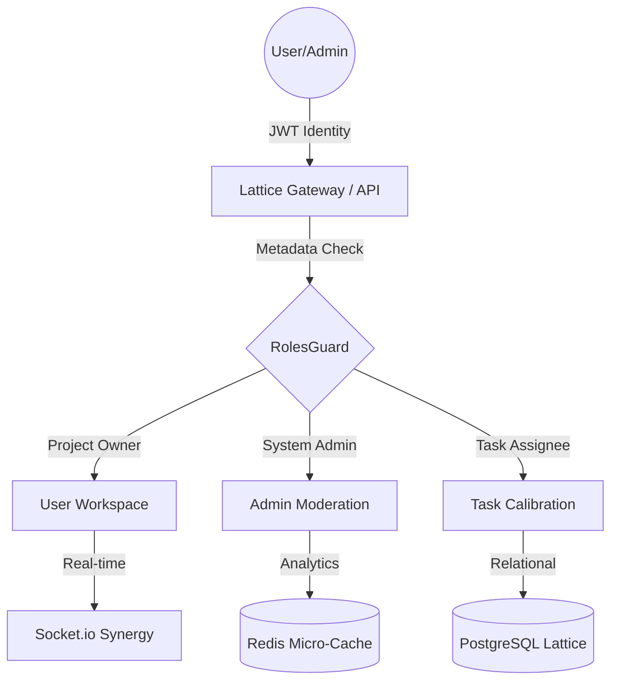

# 🌿 TaskFlow Elite: Enterprise Ecosystem Manager

[](https://nestjs.com/)
[](https://reactjs.org/)
[](https://www.postgresql.org/)
[](https://redis.io/)

> **Elite-tier Engineering Submission** for the Greening India Assignment. A high-performance, perspective-based task management ecosystem featuring relational RBAC, real-time synergy, and visual excellence.

---

## 📖 Table of Contents
1. [🌟 Mission & Overview](#-mission--overview)
2. [🗺️ Identity Registry (Credentials)](#-identity-registry-credentials)
3. [🛡️ Role Capability Matrix](#-role-capability-matrix)
4. [🏗️ High-Engineering Architecture](#-high-engineering-architecture)
5. [🛤️ API Perspective Matrix](#-api-perspective-matrix)
6. [🚥 Getting Started (Elite Setup)](#-getting-started-elite-setup)
7. [📬 Developer Tooling (Postman)](#-developer-tooling-postman)

---

## 🌟 Mission & Overview
TaskFlow Elite is not just a project manager; it's a **Perspective-Based Organizational Platform**. Designed specifically for moderated environmental projects under **Greening India**, the system ensures that every user—from field ecologists to global administrators—has a tailored interface and access profile optimized for scalability and data integrity.

---

## 🗺️ Identity Registry (Credentials)
The ecosystem lattice is pre-seeded with the following synchronized identities for immediate evaluation:

| Identity | Role | Email | Password | Perspective |
| :--- | :--- | :--- | :--- | :--- |
| **System Admin** | `admin` | `test@example.com` | `password123` | Global Moderation |
| **Field User** | `user` | `user@taskflow.com` | `password123` | Standard Workspace |
| **Community Guardian** | `user` | `guardian@taskflow.com` | `password123` | Default Assignee |

---

## 🛡️ Role Capability Matrix
Our **Relational RBAC** engine enforces strict isolation between standard operations and administrative moderation.

| Capability | Standard User | Project Owner | Task Assignee | System Admin |
| :--- | :---: | :---: | :---: | :---: |
| View All Projects | ✅ | ✅ | ✅ | ✅ |
| Create Projects | ✅ | ✅ | ✅ | ✅ |
| Edit/Delete ANY Project | ❌ | ❌ | ❌ | ✅ |
| Edit/Delete OWN Project | ❌ | ✅ | ❌ | ✅ |
| Create Tasks in OWN Project | ❌ | ✅ | ❌ | ✅ |
| Edit/Delete Task they **created** | ❌ | ✅ | ✅ | ✅ |
| Edit/Delete Task **assigned** to them | ❌ | ❌ | ✅ | ✅ |
| Edit/Delete **any** Task | ❌ | ❌ | ❌ | ✅ |
| Change Task Status (Drag & Drop) | ❌ | ✅ | ✅ | ✅ |
| View Project Analytics / Stats | ✅ | ✅ | ✅ | ✅ |
| Global System Stats | ❌ | ❌ | ❌ | ✅ |

---

## 🏗️ High-Engineering Architecture

### 🌀 The Lattice Flow
Our architecture utilizes a **Perspective-Based Orchestration** where the UI and Backend are synchronized via metadata-driven guards.



### 📂 Directory Structure (Zero-Mixing)
TaskFlow Elite isolates concerns at the file-system level to prevent logic leakage.

```text
src/
├── auth/                  # JWT & Passport identity services
├── common/                # Shared infrastructure (Guards, Caching, Events)
├── projects/
│   ├── controllers/
│   │   ├── user/          # Perspective: Standard operations
│   │   └── admin/         # Perspective: System Moderation & Stats
│   └── services/          # Core & Admin logic separation
├── tasks/                 # Segmented similarly for Task lifecycle
└── users/                 # Relational RBAC Identity Provider
```

---

## 🛤️ API Perspective Matrix

| Method | Root Path | Context | Access | Description |
| :--- | :--- | :--- | :--- | :--- |
| `GET` | `/api/v1/health` | **Public** | Open | System Heartbeat |
| `GET` | `/api/v1/users` | **Authenticated**| Any | Lattice Identity Registry |
| `POST` | `/api/v1/auth/login` | Public | Open | Identity Manifestation |
| `GET` | `/api/v1/projects` | User/Admin | Auth | Perspective-Aware List |
| `GET` | `/api/v1/projects/:id/stats` | Owner/Admin | Auth | Node Vitality Metrics |
| `PATCH`| `/api/v1/tasks/:id` | **Owner/Assignee**| Auth | Task Node Calibration |
| `GET` | `/api/v1/admin/projects/system/stats` | **Admin Only** | Restricted | Global Ecosystem Pulse |
| `DELETE`| `/api/v1/projects/:id` | **Admin Only** | Restricted | Global Node Moderation |

---

## 🚥 Getting Started (Elite Setup)

### 🐳 The One-Command Experience (Docker)
1. **Launch Stack**: `docker-compose up --build`
   *This automatically runs all migrations and seeds the identities listed above.*

### 🛠️ Manual Development
1. **Reset Lattice**: `cd backend && npm run typeorm migration:run -- -d src/common/db/data-source.ts`
2. **Seed Data**: `npm run seed`
3. **Startup**: `cd frontend && npm run dev`

---

## 📬 Developer Tooling (Postman)
A professional-grade **Postman Collection** is included at the root: `taskflow.postman_collection.json`.

- **Perspective-Folders**: Divided into `Auth`, `Workspace`, and `Moderation`.
- **Automated Auth**: The login script automatically updates your `bearer_token` environment variable.

---
*Built with Engineering Precision for the Greening India Assignment. Focus on Visual Excellence, System Stability, and Architectural Maturity.* 🌿
